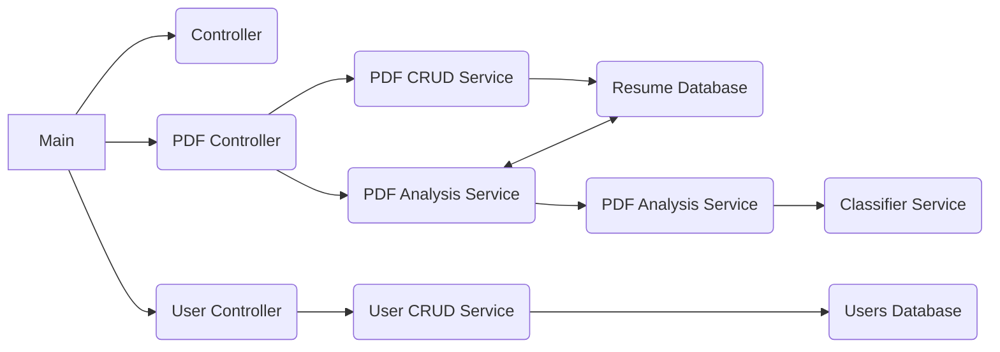

# Project: Resume Indexer

 **Authors:** Daniel Silva and Jorge Lucas /
 **Supervisor:** Lucas Alves
 
## Getting Started

### Requirements :hammer_and_wrench:

- Python 3.10
- Virtual Environment
- A package installer for Python (I used pip in this project)

### 1. Installation process :inbox_tray:

Open the terminal and follow the following steps:

```bash
#Clone this repository
git clone https://github.com/jorgelucas-rm/cv-indexing.git

#Create a virtual environment
python3.10 -m venv .venv

#Activate your virtual environment
source <.venv>/bin/activate ## ON LINUX
.\.venv\Scripts\activate.bat ## ON WINDOWS

#Install the requiriments.txt
pip install -r requiriments.txt
```

### 2. Launch the API :rocket:

Open the terminal in the project directory and take two more steps:

```bash
#Enter the API folder
cd API

#Just do it!
uvicorn main:app --reload
```

### 3. Enjoy :wink:

 Go to http://127.0.0.1:8000/ in your browser
 
##  Introduction

### Target :dart:
Create an API with a CRUD for PDF files and a resume categorization function.

### Briefing
This project aims to develop a machine learning model that can analyze resumes and extract relevant information, such as field of expertise and level of expertise. The project was based on five Jupyter notebooks, each with a specific task.

### Functional Requirements 
- Reception of resumes in PDF
- Classification of the area of ​​activity
- Seniority Classification (Junior, Mid-level, Senior)
- API Response:
	- Classified area of ​​activity.
	- Classified seniority level.
	- Confidence or probability score for each classification.

### Non-Functional Requirements
- Performance
- Scalability
- Security
- Monitoring and Logging

## Project structure 

### Architecture
In this project we use MVCS - Model View Controller Service architecture. With it we divide the API into four fields:

- Controller
>Where we have routes, make service requests and returns to the front-end.

- Data base
>Where we store user data and resumes.

-  Model
>Where we create the system objects, store the trained model and the mapping to convert the trained model's responses.

- Service
>Where we have the main back-end functions and activities.

### System UML


### Libraries

#### Pre-Commit

- This library was very useful, with it we could define formatting standards for the code before generating the commit. In this project, we use it linked to the Black, Flake8 and Isort libraries.
	- Black: Performs code indentation based on pep8 conventions;
	- Flake8: Suggests improvements to code readability;
	- Isort: Format code imports based on pep8 conventions.

#### Fast API
- FastAPI is a modern, fast (high-performance), web framework for building APIs with Python 3.7+ based on standard Python type hints. In this project she was the main back-end library, with it we created the system infrastructure

#### GLiNER (Generalized Lightweight Information Extraction)
- GLiNER is used in the test_extract_v1.ipynb and test_extract_v2.ipynb notebooks to extract Named Entities (NER) from resumes. GLiNER is a lightweight and efficient library for information extraction, making it suitable for processing large volumes of text data. In the context of the project, GLiNER was been tested and would be used to extract relevant information from resumes, like the level of expertise, as well as names, locations, and organizations, which can be used to improve the accuracy of the machine learning models.

#### Scikit-learn
- Scikit-learn is used in the class_train_v1.ipynb and class_train_v2.ipynb notebooks for feature extraction and classification. Scikit-learn is a popular machine learning library that provides a wide range of algorithms for classification, regression, clustering, and more. In the project, Scikit-learn is used to extract features from the resume data using techniques such as CountVectorizer, and to train machine learning models for classification tasks, such as predicting the field of expertise.

#### Spacy
- Spacy is used in the csv_create.ipynb notebook for tokenization, stopword removal, lemmatization, and lowercasing. Relevance: Spacy is a modern natural language processing (NLP) library that provides high-performance, streamlined processing of text data. In the project, Spacy is used to preprocess the resume data, which is essential for training accurate machine learning models. Spacy's tokenization and lemmatization capabilities help to normalize the text data, reducing the dimensionality and improving the quality of the features.

#### XGBoost
- XGBoost is a popular and highly efficient gradient boosting library that provides state-of-the-art performance for many machine learning tasks. In the project, XGBoost is used to train machine learning models for classification tasks, such as predicting the field of expertise, and regression tasks, such as predicting the level of expertise. XGBoost's ability to handle large datasets and its high accuracy make it a suitable choice for your project.

### Datasets

https://www.kaggle.com/datasets/snehaanbhawal/resume-dataset
https://www.kaggle.com/datasets/danicardeal/resume-occupation-and-seniority

## Conclusions

- ### Daniel :man_shrugging:
In this project I've learned how to use the libraries to extract text from pdf, pre process to enhance the working on it, create csv, vectorize the text and train AI models, save the pre-trained model to use in other parts of the project, like implementing in an API that will receive a PDF and make it pass through this process. I've worked in collaboration with my colleague Jorge, who created the API with perfection and clean code, as well as helped me in the proccess of learning all this new technologies and version control worked with my code to implement in the API.

- ### Jorge :cowboy_hat_face:
I had a lot of fun with this project, I had never worked with an API before, much less with machine learning, but I'm happy to be able to overcome these challenges and delve deeper into these topics. During these weeks I managed to develop many hard skills, especially those related to code organization and GIT flow.
I really enjoyed developing this project with the group, especially with my partner, Daniel. I learned a lot of things from them and I hope I contributed too.